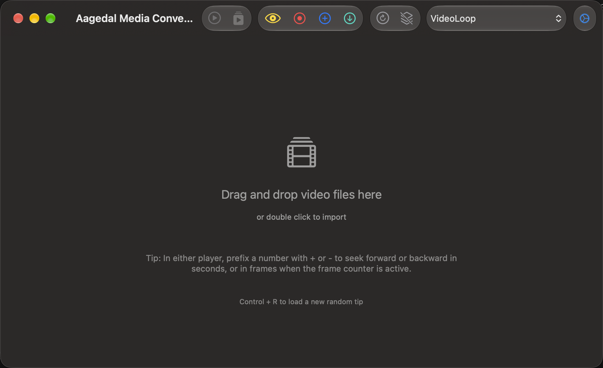
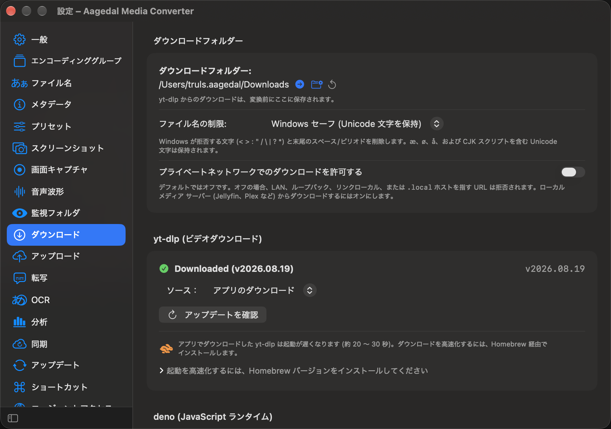

# 4.5.1 downloads, localization, and tips validation — 2026-10-02

Debug build and eight targeted XCTest cases passed with no failures:

- Four unit tests cover failed-download update eligibility and bounded version probes, including nonzero exit, truncation, launch failure, timeout, and cancellation.
- Two UI tests verify that app-managed failed downloads offer update guidance and open Downloads settings, including an already-open Settings window. Homebrew and custom tools do not offer app-managed updates.
- The tip layout UI test verifies wrapping and Control+R refresh in English and Norwegian at a window size of 860 × 525.
- The new-language UI test launches German, Spanish, French, Italian, Japanese, Korean, Brazilian Portuguese, and Simplified Chinese. It verifies the camera-card tip, localized General/Downloads sidebar labels, and navigation to both settings panes.

The localization audit passes for 1,815 catalog entries: all eight added languages have zero missing translatable keys. Norwegian's 17 omissions are intentional formatting tokens. All seven localization-validator unit tests pass. `git diff --check` passes.

Run the catalog checks with:

```sh
python3 scripts/check-localizations.py
python3 -m unittest discover -s scripts/tests -p test_localizations.py
```

The Xcode result bundle from this run is `/private/tmp/amc-451-pr-validation.xcresult`; its build/test log is `/private/tmp/amc-451-pr-validation.log`. The tests use local download-failure fixtures and injected version-probe results; they do not perform a live YouTube download or replace the user's installed yt-dlp binary. The eight added languages are a first pass, with strings awaiting linguistic review marked Needs Review.




