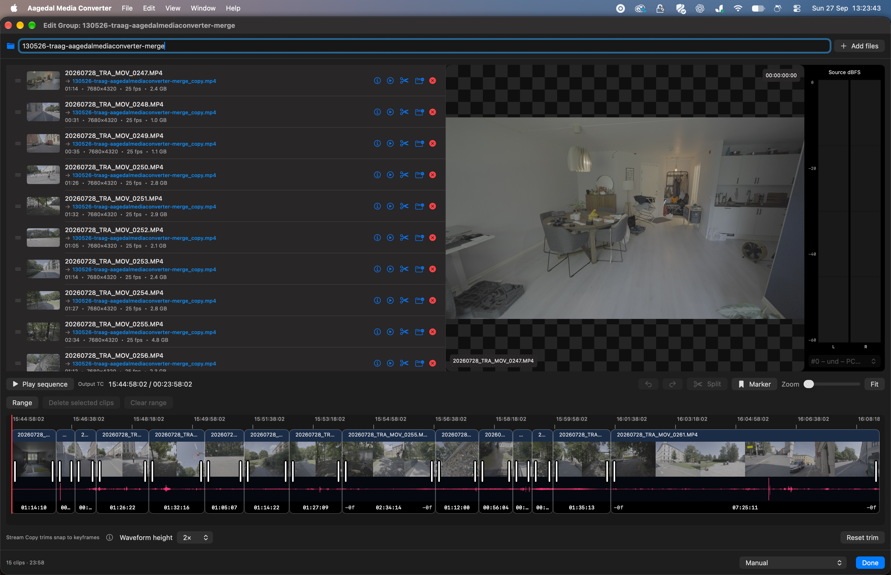

# Aagedal Media Converter

[English](../../README.md) · [Norsk bokmål](README.nb.md) · [Español](README.es.md) · [简体中文](README.zh-CN.md) · [Français](README.fr.md) · [Italiano](README.it.md) · [Deutsch](README.de.md) · [日本語](README.ja.md) · [Português (Brasil)](README.pt-BR.md) · [한국어](README.ko.md)


Une application macOS légère et minimaliste, simple en apparence mais dotée de fonctions puissantes. Elle utilise FFmpeg, MPV, SwiftMediaMetadata, yt-dlp, rclone et whisper.cpp, et est entièrement écrite en Swift / SwiftUI.

Entièrement gratuite et open source. Privée et locale. La vérification facultative des mises à jour est activée par défaut, mais peut être désactivée.

Un projet personnel né d'une passion : je l'ai créée pour travailler plus efficacement et j'ai voulu la partager. La majeure partie de l'application a été développée en « vibe coding », avec l'aide de l'IA.

---

## Installation

### Homebrew
```bash
brew tap aagedal/tap && brew install --cask aagedal-media-converter
```

### Téléchargement manuel
[Télécharger la version actuelle](https://github.com/aagedal/Aagedal-Media-Converter/releases/latest)

---

## Fonctions principales

- **Démarrage rapide et utilisation simple**
- **Conversion par lots** de presque tous les fichiers vidéo et audio (alternative à Shutter Encoder ou Handbrake)
- **Lecture** en plein écran avec timecode et commandes JKL (alternative à IINA ou VLC)
- **Consultation et comparaison des métadonnées**, avec détection de C2PA (alternative à MediaInfo)
- **Téléchargement** de vidéos depuis des sites web, avec planification et téléchargement de diffusions en direct
- **Enregistrement d'écran** avec son système et piste de microphone séparée facultative (alternative à OBS)
- **Transcription** de vidéos et fichiers audio en sous-titres SRT
- **Envoi** vers un serveur après conversion

- **Assembler** des clips dans une timeline avec prévisualisation de la séquence et rognage avec décalage des clips suivants
- **Automatiser les conversions par MCP local** avec accès facultatif pour les agents

### Général

- Prévisualiser et encoder presque tous les fichiers vidéo
- Importer et exporter des **séquences d'images** (PNG, TIFF, EXR, DPX, JPEG 2000, etc.) avec audio associé et réglage de la cadence
- Exporter des **DCP (Digital Cinema Package)** avec image JPEG 2000 XYZ et audio PCM
- Exporter des paquets expérimentaux **IMF App 2e et RDD 45** à valider dans l’outil de livraison
- Conversion par lots, dossier surveillé et barre de progression
- Rogner la durée, recadrer l'image, réaffecter ou supprimer les pistes audio et assembler des clips de même format
- Consulter et comparer les métadonnées
- De nombreux [raccourcis clavier](../../KeyboardShortcuts.md) : la plupart des fonctions sont accessibles sans souris
- De nombreux réglages de personnalisation
- Vérification automatique des mises à jour avec notification discrète, désactivable
- Téléchargement depuis YouTube, TikTok, etc. (yt-dlp)
- Transcription en SRT (whisper.cpp)
- Envoi par FTP (rclone)
- Vérification de signature C2PA (SwiftMediaMetadata)
- Enregistrement d'écran en HDR avec son système et microphone facultatif sur une piste séparée

### Conversion par lots

- Encoder automatiquement tous les fichiers de la file d'attente
- Réorganiser l'ordre d'encodage par glisser-déposer
- Retirer des fichiers de la file pendant l'encodage

### Dossier surveillé

- Importer automatiquement les fichiers d'un dossier choisi
- Fonctionne en parallèle de l'importation manuelle par glisser-déposer, en réunissant les conversions dans une seule fenêtre
- Options de suppression automatique et d'exclusion de fichiers du dossier
- Activation par l'icône en forme d'œil dans la barre d'outils de la fenêtre principale

### Prévisualisation

- Raccourcis habituels de montage, comme JKL et les flèches
- Indicateur de niveau audio simple (⌘A)
- Lecteur natif de macOS pour les fichiers compatibles, avec lecture fluide même en arrière
- Passage automatique à MPVKit pour les fichiers non pris en charge nativement, avec une lecture arrière moins fiable

### Ajustements rapides

- Rogner la durée avec les poignées ou les touches I/O
- Copier le timecode de la source, le définir manuellement ou le supprimer
- Recadrer avec les commandes à l'écran ; appuyer sur C ou sur l'icône de recadrage dans la vue de rognage
    - Ne fonctionne pas avec le préréglage Stream Copy
- Supprimer ou réorganiser les pistes audio
    - Ne fonctionne pas avec le préréglage Stream Copy

### Assembler les fichiers de la file d'attente

- Assembler des fichiers ayant les mêmes codec, résolution, cadence, profondeur de couleur et pistes audio
- Le premier clip détermine le timecode et le recadrage
- Modifier les groupes dans la timeline avec bandes de miniatures, lecture de séquence, rognage avec décalage, réorganisation, division, suppression de plages et annulation.
- Rogner et assembler avec Stream Copy sans réencodage. Les coupes dépendent des images clés de la source et peuvent différer des limites sélectionnées ; certaines métadonnées peuvent être perdues.
- Exporter des marqueurs de clips en EDL pour Resolve et des chapitres intégrés, avec le choix de conserver ou de remplacer les chapitres existants.

### Importation de cartes de caméra

- Examiner les clips par dossier de carte et date d’enregistrement avant l’importation.
- Marquer explicitement les continuations d’enregistrement et, si souhaité, séparer les groupes après des interruptions de plus de deux heures. Les vérifications de compatibilité aident à identifier les clips assemblables.

### Accès local pour les agents

Activez **Settings → Agent Access**, autorisez les dossiers sources et copiez la configuration pour votre client MCP. L’outil fourni permet aux agents de parcourir et d’inspecter les médias autorisés, de planifier des conversions, de soumettre des tâches, de suivre leur progression et de les annuler dans la file de l’application. Les 17 préréglages intégrés sont disponibles ; les préréglages FFmpeg personnalisés sont exclus. Les exportations IMF sont expérimentales.

Les tâches acceptées continuent après la déconnexion du client. Les plans sont valables 15 minutes et les résultats des tâches terminées restent disponibles 30 jours. Les exportations par agents désactivent le timecode de sortie. Consultez le [guide de configuration et de workflow](../../Documentation/LOCAL_AGENT_ACCESS.md) pour les autorisations de dossiers, la configuration des clients et la récupération des tâches.

### Animations de formes d'onde audio

- Générer des animations de formes d'onde pour les fichiers uniquement audio
- Cinq préréglages avec options de couleur et de normalisation

### Captures à la résolution et à la profondeur de couleur de la source

Le bouton appareil photo du lecteur de rognage capture des images à la résolution d'origine. Le format par défaut est JPEG XL. Les réglages permettent de choisir un format selon la profondeur de couleur et de définir le traitement du canal alpha.

### Exportation et noms de fichiers

- Par défaut, les espaces et caractères spéciaux sont supprimés. æ, ø et å sont remplacés par ae, o et aa.
- Aperçu du nom de fichier traité
- Avertissement si le fichier existe déjà
- Après encodage, une icône affiche le fichier converti dans le dossier d'exportation
- Une autre icône permet de glisser le résultat vers une autre application ou un autre dossier
- Choix du préréglage par défaut dans les réglages
- Choix du dossier d'exportation par défaut

### Métadonnées

- Champ de commentaire par fichier pour des métadonnées facultatives, par exemple les crédits
- Date facultative (Generated [YYYYMMDD]), préfixe et suffixe ajoutés dans le champ avant le commentaire
- Consultation et comparaison des métadonnées

### Avertissement de lecture automatique à 15 secondes pour VideoLoop

Les navigateurs refusent souvent la lecture automatique de longues vidéos en boucle avec son. Une icône jaune ⚠️ apparaît lorsque les préréglages VideoLoop sont appliqués à des clips de plus de 15 secondes, pour inviter à les raccourcir ou à choisir un autre préréglage.

### App Intents

1. Ajouter à la file d'encodage.
2. Convertir immédiatement une vidéo avec le préréglage par défaut.

---

## Préréglages d'exportation

Tous les préréglages peuvent être définis comme valeur par défaut au démarrage. Tous, sauf celui par défaut, peuvent être masqués dans le sélecteur.

#### Video Loop

Optimisé pour les boucles silencieuses et continues. Encodage x264 à CRF 23 (environ 3–9 Mbps de débit variable), suppression de l'audio et limitation du côté le plus court à 1080 pixels pour le web. Un avertissement apparaît au-delà de 15 secondes.

#### Video Loop w/ Audio

Les mêmes réglages x264, mais toutes les pistes audio sont conservées en AAC à 128 kbps. Le côté le plus court reste limité à 1080 pixels.

#### H.264 / AVC

Encodage H.264/AVC largement compatible. Choix entre VideoToolbox par matériel pour la rapidité et libx264 par logiciel avec contrôle CRF pour la qualité. Conteneurs MP4, MOV et MKV.

#### H.265 / HEVC

Encodage H.265/HEVC moderne en 10 bits. VideoToolbox accélère l'exportation par matériel ; libx265 par logiciel offre une grande efficacité de compression.

#### AV1

Encodage SVT-AV1 avec prise en charge de 10 bits et forte efficacité de compression. Uniquement logiciel, sans accélération matérielle sur macOS.

#### AV2 (expérimental)

Encodage AV2 expérimental avec l'encodeur de référence AOM AVM fourni (`avmenc`), introduit dans une version préliminaire. Prend en charge les sorties 8/10 bits, la qualité constante ou le débit variable, ainsi qu'une vitesse et une résolution réglables. L'encodage parallèle par segments utilise plusieurs cœurs CPU en mode qualité constante.

Choisir IVF (`.ivf`) pour la vidéo seule ou Matroska (`.mkv`) avec audio AAC ou Opus. L'encodage de référence est très lent et le flux binaire, encore en évolution, nécessite un décodeur compatible AV2. L'application peut décoder les fichiers AV2 pour les conversions et les miniatures, mais la lecture interactive n'est pas encore disponible. AV2 est destiné à l'expérimentation plutôt qu'à la livraison.

#### TV (HEVC 10-bit 4:2:2)

Format de livraison pour la diffusion avec HEVC matériel 10 bits 4:2:2, résolution et cadence réglables, adaptation automatique du débit et conservation de tous les canaux audio en PCM 24 bits.

#### TV (AVC-Intra)

Format de diffusion dans un conteneur MXF. AVC-Intra 10 bits 4:2:2 avec classes au choix (50/100/200 Mbps), résolution et cadence, ainsi que 4/8/16 canaux mono en PCM 24 bits.

#### Stream copy

Copie les flux audio et vidéo existants dans un nouveau fichier, en conservant les codecs, métadonnées et extension d'origine. Adapté au rognage et à l'assemblage.

#### ProRes

Apple ProRes (yuv422p10) pour des masters faciles à monter. Inclut les premiers flux vidéo et audio, conserve l'audio PCM 24 bits et utilise les débits standard ProRes. Le profil par défaut se choisit dans les réglages des préréglages.

#### Proxy

Création de proxies légers en HEVC, ProRes Proxy ou DNxHR avec limite de résolution réglable. Conserve tous les canaux audio en PCM non compressé, idéal pour le montage offline et un sous-dossier Proxy dédié à côté des sources.

#### DCP (Digital Cinema Package)

Exportation DCP conforme à SMPTE. Encode la vidéo en JPEG 2000 dans l'espace XYZ 12 bits avec conversion de l'entrée BT.709, encapsule en MXF avec asdcp-wrap et génère tous les XML SMPTE nécessaires (CPL, PKL, ASSETMAP, VOLINDEX). Prend en charge les formats 2K et 4K Flat, Scope et Full à 24/25/30/48 fps, avec débit réglable de 100–250 Mbps. L'audio est exporté en PCM 24 bits dans une piste MXF séparée. Les métadonnées par élément incluent titre, type de contenu, annotation, classification et langue audio. Mise à l'échelle : ajuster avec bandes ou remplir en recadrant.

#### IMF App 2e / RDD 45 (expérimental)

Exportation expérimentale de paquets IMF avec une piste image et une piste audio PCM. Les sous-titres dans le paquet et les pistes audio multiples ne sont pas pris en charge. Validez chaque paquet dans l’outil de mastering ou de livraison prévu avant de le livrer.

#### Image Sequence

Importation et exportation de séquences en PNG, JPEG, TIFF, EXR, DPX, BMP, TGA, SGI, JPEG XL et JPEG 2000. Détection automatique de la numérotation et prise en charge des numéros manquants. Des fichiers audio peuvent être associés pour la lecture et l'exportation. La cadence se règle par séquence ou se calcule d'après la durée de l'audio associé. L'exportation peut inclure des fichiers annexes de métadonnées (Markdown ou JSON) avec espace colorimétrique, codec et informations de caméra.

#### Animated Stills

Séquences animées en GIF, AVIF ou PNG animé (APNG), sélectionnables dans les réglages des préréglages.

#### Audio Only AAC

Réduction en stéréo AAC qui préserve l'image stéréo tout en réduisant fortement la taille du fichier.

#### Audio Only WAV

Exportation WAV non compressée conservant tous les canaux audio lorsque c'est possible.

#### 10 préréglages FFmpeg personnalisés

Dix préréglages (C1–C10) permettent de définir les arguments de sortie, suffixes et extensions. Les paramètres d'entrée sont gérés automatiquement. Les chemins avec `-copy` ne peuvent pas être combinés aux options de recadrage ou de réaffectation audio des réglages de préréglages.

#### [À faire / problèmes connus](../../TODO.md)

---

## Captures d'écran

#### Vue de la timeline du groupe

Prévisualisez une séquence à côté de la liste des clips, avec miniatures, formes d'onde audio, poignées de rognage et timecode de sortie. La timeline propose aussi des commandes de division, de marqueurs, de sélection de plages et de zoom.



#### Vue de rognage


#### Vue de recadrage


#### Réaffectation audio


#### Vue des téléchargements


#### Vue des métadonnées


#### Modification du timecode


#### Réglages


#### Lecteur plein écran


---

## Configuration requise

| | Minimum |
|---|---|
| macOS | 15.0 (Sequoia) ou version ultérieure |
| Matériel | Apple Silicon (M1 ou version ultérieure) |

---

## Utilisation

1. Lancez l'application.
2. Glissez des vidéos dans la fenêtre ou cliquez sur le bouton plus pour les importer.
3. Choisissez un **préréglage d'exportation** dans la barre d'outils.
4. Cliquez sur le bouton vert *Convert* ou appuyez sur ⌘⏎.

Il s'agit d'un projet personnel réalisé sur mon temps libre, sans rémunération.

---

## Licence

Ce projet est distribué sous la **GNU General Public License, version 3.0**. Le texte complet figure dans [LICENSE](../../LICENSE).

Le binaire FFmpeg fourni est compilé avec `--enable-gpl` et relève de la **GPL v2 ou ultérieure**. Le projet utilise la GPL v3 pour tout son code, ce qui satisfait cette exigence. Voir la [licence d'origine de FFmpeg](../../Licenses/ffmpeg-LICENSE.txt).

Le binaire asdcp-wrap fourni provient d'[asdcplib](https://github.com/cinecert/asdcplib), de John Hurst, sous **BSD 3-Clause License**. Voir la [licence d'asdcplib](../../Licenses/asdcplib-LICENSE.txt).

---

## Remerciements

Le traitement des couleurs de l'exportation DCP s'appuie sur l'excellente documentation de [DCP-o-matic](https://dcpomatic.com/) concernant la conversion vers l'espace DCI XYZ. DCP-o-matic est un outil de création de DCP gratuit et open source : [projet GitHub](https://github.com/cth103/dcpomatic).

L'inspection des métadonnées et les fonctions d'authenticité C2PA utilisent [SwiftMediaMetadata](https://github.com/aagedal/SwiftMediaMetadata).

---

PS ! Cette application s'appelait auparavant Aagedal VideoLoop Converter. Aagedal Media Converter est la même application, avec un nom qui reflète mieux ce qu'elle est devenue.
